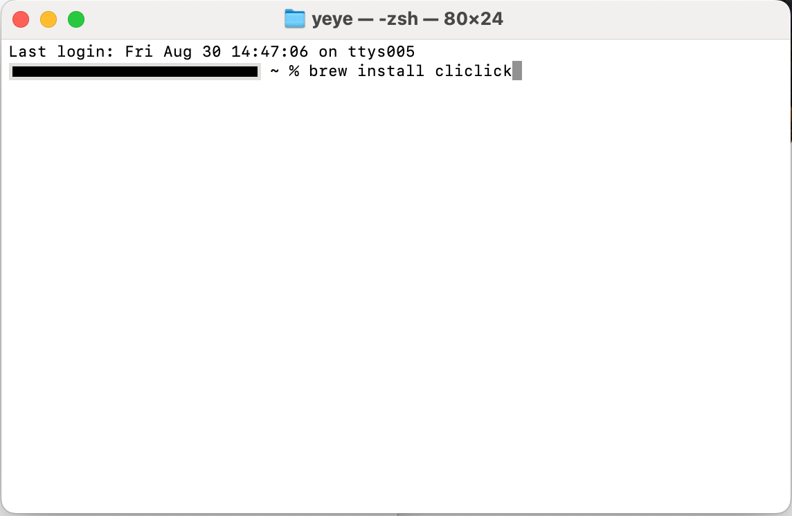
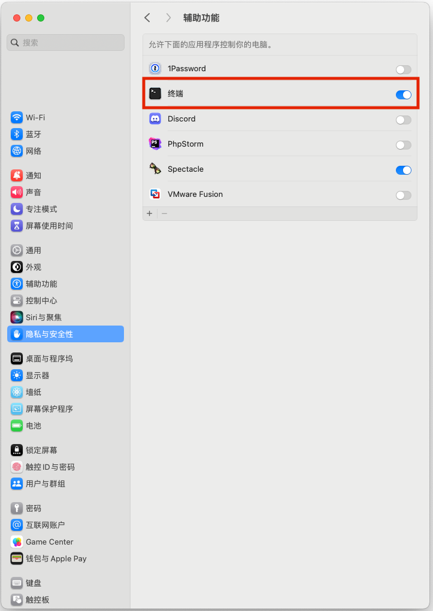

# 「鼠标不停点点点」很烦？一招搞定 Mac 鼠标连续点击，解放双手。

> 本教程适用于 Mac，适用于任何需要连续点击的场景。


## 1. 安装 cliclick

打开终端，输入 `brew install cliclick`


如果提示 `brew command not found`，参考如下教程安装：https://brew.sh/zh-cn/

## 2. 设置终端权限

给终端设置辅助权限，路径：设置 -> 隐私与安全 -> 辅助功能 -> 终端


⚠️：为了安全起见，当不需要使用该脚本后建议关掉。

## 3. 下载 auto_click_single.sh 脚本

在终端中输入（也可以直接使用 git 下载源码，这里就不赘述了）

```shell
curl -O https://github.com/11001100111011101110001/auto_click/blob/main/auto_click_single.sh
```
⚠️：如果没有切换到其他文件夹下，文件路径默认为：/Users/用户名/auto_click_single.sh ，这里的用户名等于当前 Mac 登陆的用户设定的名字。

## 4. 在终端中给脚本赋予执行权限

```shell
chmod +x auto_click_single.sh
```

## 5. 获取需要点击的坐标

> 打开需要点击的界面，例如 Ton 小程序，获取需要点击的横纵坐标。

获取方法：使用 shift + command + 4 将鼠标移到需要点击的位置，就可以看到横纵坐标了。

## 6. 执行脚本

```shell
# 语法
./auto_click_single.sh 横坐标 纵坐标 点击次数 点击间隔（秒）

# 例如：./auto_click_single.sh 1500 600 755 0.2
# 含义：点击横坐标 1500 纵坐标 600 的地方 755 下，每下「间隔 0.2 秒」。
```

## 7. 注意事项

1. 当脚本运行后会占用鼠标，在脚本运行期间无法停止，建议在无需使用电脑时运行。
2. 脚本只会在「主屏幕」生效，暂时无法点击「副屏」。
3. 普通人默认 1 秒中可以连续点击 8-10 次鼠标，在使用时为了防止被误认为机器人，建议间隔时间设置在 0.1 秒以上。